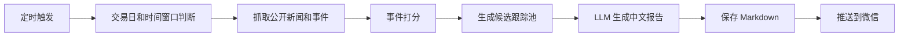

# investment-agent

`investment-agent` 是一个自动化美股科技成长事件雷达。它会在每个美股交易日开盘前，抓取公开市场重大事件，结合 LLM 生成中文 Markdown 报告，并推送到个人微信。

这个项目的定位不是自动荐股，也不是自动交易系统。它更像一个每天开盘前帮你做信息筛选的研究助手：先把重要事件、主题热度和候选跟踪标的整理出来，再提醒你哪些内容值得进一步验证。

## 项目用途

系统重点覆盖以下方向：

- AI 算力
- 半导体
- 数据中心
- 云计算
- 电力基础设施
- 核能
- 机器人
- 自动驾驶
- 网络安全
- IPO / 新上市公司

项目也包含一个独立核心模块 `macro_market_intelligence_engine`，用于识别每日市场的资金状态，而不是预测价格。它会把宏观变量统一解释为：

```text
宏观变量变化 -> 流动性变化 -> 风险偏好变化 -> 资金流变化 -> 估值变化 -> 个股反应
```

该模块输出唯一市场状态：

- `Risk-On`
- `Repricing`
- `Risk-Off`

并机制化解释 MSFT、ATXI 以及可扩展股票的资金影响路径。

当前日报已经把宏观资金状态和科技事件雷达合并输出：先说明市场处于 `Risk-On` / `Repricing` / `Risk-Off` 哪个资金周期，再解释对 MSFT、ATXI 等资产的资金影响路径，最后给出科技成长重大事件与候选跟踪池。

每天报告会包含：

- 今日结论
- 重大事件
- 科技成长主题
- 候选跟踪池
- IPO / 新上市
- 风险与噪音过滤
- 今日关注清单

## 核心原则

- 不自动下单。
- 不把新闻热度直接等同于投资价值。
- 候选跟踪池只是研究优先级，不是买入建议。
- 优先验证订单、收入、利润率、现金流、估值和风险。
- 默认禁用 Moomoo 账户读取，当前主模式为公开市场事件雷达。
- 默认禁用自动交易：`AUTO_TRADING=false`。
- 即使未来开启自动交易，也要求人工确认：`REQUIRE_HUMAN_CONFIRM=true`。

## 工作流程



## 技术栈

- Python 3.11+
- requests
- pandas
- pydantic
- loguru
- PyYAML
- OpenAI Responses API
- BigModel API, tested with `glm-4.6v`
- ServerChan / PushPlus 微信推送
- GitHub Actions
- macOS LaunchAgent
- Linux Cron

## 目录结构

```text
investment-agent/
  analysis/
    event_analyzer.py
    portfolio_analyzer.py
    risk_engine.py
  broker/
    moomoo_client.py
  data/
    event_radar.py
    market_data.py
    news_fetcher.py
    sector_scanner.py
  llm/
    event_report_client.py
    openai_client.py
  notify/
    wechat_bot.py
  scheduler/
    market_calendar.py
  tests/
  main.py
  config.py
  schemas.py
  logging_config.py
  settings.yaml
  requirements.txt
  .env.example
  .github/workflows/premarket.yml
```

## 安装

克隆项目：

```bash
git clone https://github.com/Kenzeng521/investment-agent.git
cd investment-agent
```

创建虚拟环境：

```bash
python3.11 -m venv .venv
source .venv/bin/activate
```

安装依赖：

```bash
python -m pip install --upgrade pip
pip install -r requirements.txt
```

复制环境变量模板：

```bash
cp .env.example .env
```

编辑 `.env`：

```bash
OPENAI_API_KEY=
OPENAI_MODEL=gpt-5

BIGMODEL_API_KEY=your_bigmodel_api_key
BIGMODEL_MODEL=glm-4.6v
LLM_TIMEOUT_SECONDS=45
LLM_RETRY_ATTEMPTS=2
LLM_MAX_TOKENS=1600
LLM_EVENT_LIMIT=18
LLM_CANDIDATE_LIMIT=10

AGENT_MODE=event_radar
EVENT_MAX_ITEMS=100

WECHAT_PROVIDER=serverchan
SERVERCHAN_SEND_KEY=your_serverchan_send_key
PUSHPLUS_TOKEN=

MOOMOO_ENABLED=false
AUTO_TRADING=false
REQUIRE_HUMAN_CONFIRM=true
TIMEZONE=America/New_York
```

说明：

- 如果没有 OpenAI API Key，可以只配置 `BIGMODEL_API_KEY`。
- `LLM_*` 参数用于控制模型稳定性：限制输入事件数量、输出长度、超时时间和重试次数，避免每日推送卡死。
- 如果使用 ServerChan，配置 `SERVERCHAN_SEND_KEY`。
- 如果使用 PushPlus，设置 `WECHAT_PROVIDER=pushplus` 并配置 `PUSHPLUS_TOKEN`。
- `.env` 包含密钥，不要提交到 GitHub。

## 本地运行

强制运行一次，不受交易日和时间窗口限制：

```bash
python main.py --force
```

正常定时运行时不要加 `--force`：

```bash
python main.py
```

程序会自动判断：

- 是否为美股交易日
- 是否处于美东时间 `09:00` 附近
- 是否需要跳过本次运行

报告会保存到：

```text
reports/latest.md
```

日志会保存到：

```text
logs/investment-agent.log
```

## Macro Market Intelligence Engine

`macro_market_intelligence_engine` 是与微信发送模块解耦的核心投研模块，只输出结构化 JSON 和微信可读文本，不负责发送消息。

Python 用法：

```python
from macro_market_intelligence_engine import (
    MacroIndicatorReading,
    MacroMarketIntelligenceEngine,
    MacroSnapshot,
    default_registry,
)

snapshot = MacroSnapshot(
    as_of="2026-06-26",
    indicators=[
        MacroIndicatorReading(name="10Y", value=4.5, change=0.12),
        MacroIndicatorReading(name="RealYield", value=2.1, change=0.08),
        MacroIndicatorReading(name="DXY", value=106.0, change=0.7),
        MacroIndicatorReading(name="VIX", value=24.0, change=4.0),
        MacroIndicatorReading(name="ETF_Flows", value=-4.2, change=-4.2),
    ],
)

report = MacroMarketIntelligenceEngine(default_registry()).analyze(snapshot)
print(report.to_wechat_text())
print(report.to_json_dict())
```

CLI 用法：

```bash
python scripts/run_macro_market_intelligence.py --input macro_snapshot.json --format wechat
python scripts/run_macro_market_intelligence.py --input macro_snapshot.json --format json
```

输入 JSON 示例：

```json
{
  "as_of": "2026-06-26",
  "indicators": [
    {"name": "10Y", "value": 4.5, "change": 0.12},
    {"name": "RealYield", "value": 2.1, "change": 0.08},
    {"name": "DXY", "value": 106.0, "change": 0.7},
    {"name": "VIX", "value": 24.0, "change": 4.0},
    {"name": "ETF_Flows", "value": -4.2, "change": -4.2}
  ]
}
```

股票和宏观指标通过注册表扩展，无需修改核心引擎逻辑。

## 自动执行时间

默认运行时间是：

- 美股交易日
- 美东时间 `09:00`
- 美股开盘前 30 分钟

对应北京时间：

- 夏令时：北京时间 `21:00`
- 冬令时：北京时间 `22:00`

项目内置时间窗口判断，因此可以同时配置 `21:00` 和 `22:00` 触发，错误的那次会自动跳过，避免重复推送。

## macOS LaunchAgent

可以使用 macOS LaunchAgent 在本机定时运行。示例路径：

```text
~/Library/LaunchAgents/com.zengjihong.investment-agent.plist
```

加载任务：

```bash
launchctl bootstrap gui/$(id -u) ~/Library/LaunchAgents/com.zengjihong.investment-agent.plist
```

检查状态：

```bash
launchctl print gui/$(id -u)/com.zengjihong.investment-agent
```

手动触发一次：

```bash
launchctl kickstart -k gui/$(id -u)/com.zengjihong.investment-agent
```

如果当前不在运行窗口，程序会正常启动并跳过，不会推送微信。

## Linux Cron

推荐使用纽约时区：

```cron
CRON_TZ=America/New_York
0 9 * * 1-5 cd /opt/investment-agent && /opt/investment-agent/.venv/bin/python main.py >> /opt/investment-agent/logs/cron.log 2>&1
```

如果服务器只能使用 UTC，可以同时配置夏令时和冬令时触发：

```cron
0 13 * * 1-5 cd /opt/investment-agent && /opt/investment-agent/.venv/bin/python main.py >> /opt/investment-agent/logs/cron.log 2>&1
0 14 * * 1-5 cd /opt/investment-agent && /opt/investment-agent/.venv/bin/python main.py >> /opt/investment-agent/logs/cron.log 2>&1
```

程序会根据纽约时间窗口自动跳过不该执行的那一次。

## GitHub Actions

项目包含 GitHub Actions 配置：

```text
.github/workflows/premarket.yml
```

功能：

- 安装 Python 3.11
- 安装依赖
- 运行单元测试
- 工作日自动触发
- 手动触发时使用 `--force`
- 推送报告到微信

需要在 GitHub 仓库中配置 Secrets：

- `BIGMODEL_API_KEY`
- `SERVERCHAN_SEND_KEY`
- `OPENAI_API_KEY`, optional

需要配置 Variables：

- `BIGMODEL_MODEL`, optional, default `glm-4.6v`
- `OPENAI_MODEL`, optional, default `gpt-5`

## 微信推送

个人微信没有官方机器人 Webhook，因此本项目使用服务号推送服务：

- ServerChan
- PushPlus

ServerChan 示例：

```bash
WECHAT_PROVIDER=serverchan
SERVERCHAN_SEND_KEY=your_serverchan_send_key
```

PushPlus 示例：

```bash
WECHAT_PROVIDER=pushplus
PUSHPLUS_TOKEN=your_pushplus_token
```

## 稳定性与降级机制

LLM API 偶尔会因为网络波动、服务端排队或输出过长而超时。项目的处理策略是：

- 限制发送给模型的事件数量和候选数量。
- 限制模型最大输出 token。
- BigModel 请求失败后自动重试。
- 重试仍失败时，使用本地稳定 Markdown 渲染器生成报告。
- 即使模型超时，日报仍会生成并推送，只是语言更模板化。

这意味着自动化任务优先保证“每天有稳定报告”，而不是因为模型服务波动导致整条微信推送链路失败。

## 事实校验与推送监控

事件雷达会对新闻来源做轻量事实校验：

- 主流媒体、新闻线、公司公告来源会标记为 `较可信`。
- 社区传闻、预测性标题、匿名博客等会标记为 `低可信`。
- 其他公开来源默认标记为 `需验证`。

这些标签不是最终事实判断，而是提醒日报读者哪些内容需要进一步用公司公告、SEC 文件或权威媒体交叉验证。

系统还会记录每日微信推送状态：

```text
logs/push_state.json
```

正常定时任务如果发现当天已经成功推送，会跳过重复发送；手动 `--force` 运行仍允许再次推送，方便测试。

## 成功案例

本项目已经在本地完成以下验证：

- 成功通过 ServerChan 推送微信测试消息。
- 成功生成正式中文投资事件雷达报告并推送到微信。
- 成功安装 macOS LaunchAgent 定时任务。
- LaunchAgent 手动触发后能够调用主程序。
- 非运行窗口会自动跳过，不会误发微信。
- 单元测试通过，当前测试覆盖包括配置读取、事件抓取、事件分析、报告生成、微信推送和市场日历。

示例运行日志：

```text
Starting US equity technology event radar
Event radar report written to reports/latest.md
ServerChan notification accepted
US equity technology event radar completed
```

示例跳过日志：

```text
Outside pre-market run window; next run at 2026-06-12T09:00:00-04:00
```

示例测试结果：

```text
21 passed
```

## 测试

```bash
pytest
```

或者：

```bash
python -m pytest
```

## 发布到 GitHub

初始化仓库：

```bash
git init
git add .
git commit -m "Initial investment-agent release"
```

创建 GitHub 仓库后，关联远程地址：

```bash
git remote add origin git@github.com:Kenzeng521/investment-agent.git
git branch -M main
git push -u origin main
```

如果使用 HTTPS：

```bash
git remote add origin https://github.com/Kenzeng521/investment-agent.git
git branch -M main
git push -u origin main
```

推送前请确认：

- `.env` 没有被提交。
- `.venv/` 没有被提交。
- `logs/*.log` 没有被提交。
- `reports/*.md` 没有被提交。
- GitHub Secrets 已配置密钥。

## 安全声明

本项目输出内容仅用于信息整理和研究辅助，不构成投资建议。公开新闻可能存在延迟、误报、标题党或事实不完整。任何交易决策都应结合公司公告、SEC 文件、财报电话会、估值、仓位和个人风险承受能力独立判断。

## License

MIT
